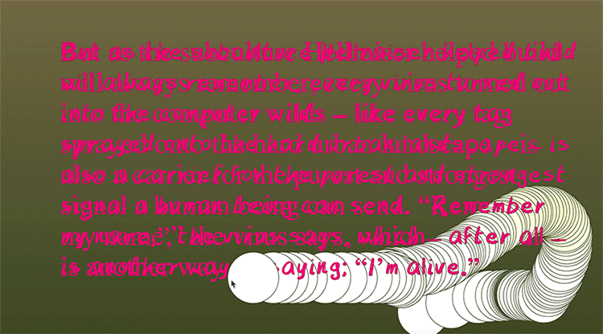
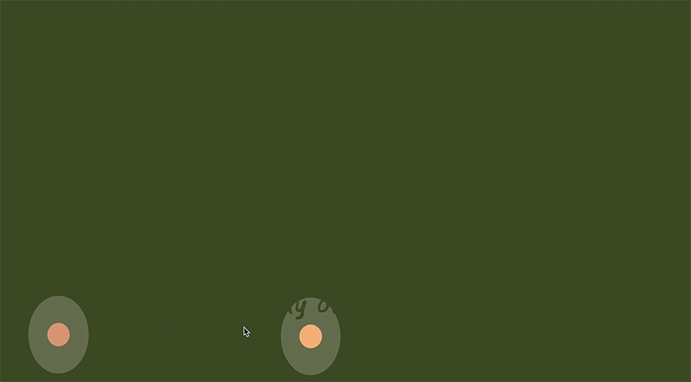

# Week #10 – Progress in the Chaos
WOOHOO, week 10 is upon us and also this week we have a milestone to submit some official progress on my website design. I’m not going to lie, many parts of my plan last week just seemed really tough to execute. Mainly the translation for Raven Kwok’s code, most of it was similar but there we little parts that were just not working no matter what I tried. 

That’s been the been the biggest things I’ve realised when working with this project, I have these big bold plans of what I would like to do. However, my skill level is just not there yet in order to actually create them. I definitely started to feel a little bit down because of this fact, but the show must go on and I knew that I could create something super cool with the skill level I did have, even if it wasn’t exactly what I hoped it to be.

[Colourful Milestone Wilds](https://astlcreations.github.io/codewords-codes-words/p5.js%20Coding%20Files/Week%20010/MainProject_TypeDesign/)

So instead, for the milestone, I decided to create a mock-up/simplified code that I know I could create with my skill level. I will say most of it was “happy accident” kind of design. But by having these “accidents” it actually helped me come up with an idea of how I wanted to convey the text. By having the text invisible or jumbled initially I then would love to have it make sense as you “draw in” the words. Almost like you need to make that effort for the text to make sense. Plus, I decided to make my own font in order to make the design seem way more wild and less controlled. Over the next week though my goals are to make the brush a little funkier and also make the overall design a little more cohesive.  

### (---------------------------------------------------------------) ###

## Now, Some Beautiful Drafts from Later in the Week that were too Beautiful not to Share ##

And also this little cutie website [~ Right Here ~](https://astlcreations.github.io/codewords-codes-words/p5.js%20Coding%20Files/Week%20010/MainProject_FIREFLIESW10/)

