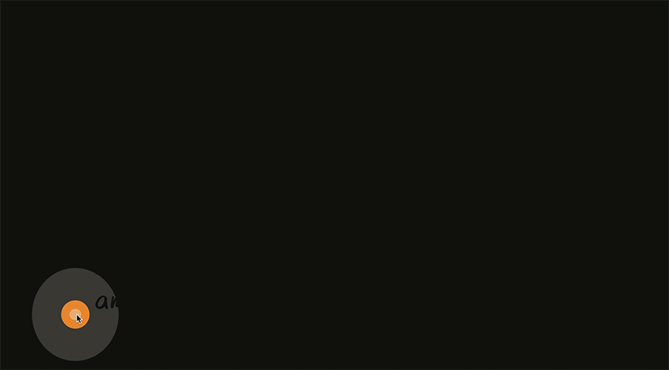
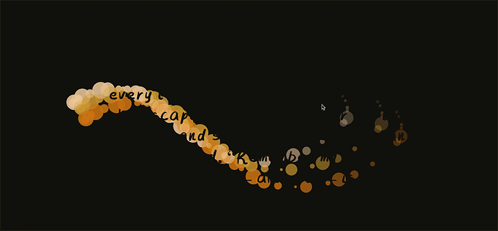

# Week #11 – I See the Light! Or Maybe Some Fireflies
Once again this was another crunch time week, working on the big project and in class we were getting some more feedback and details about the final submission. 

Before this I continued to work on the design from the week before and home in on those goals. I ended up leaning into the wild, jungle, night-time aesthetic and created a firefly effect, that needed continuous pressing and clicking from the user in order to read the text. I was very happy with the progress, but it still felt like it needed a little extra something. 

### (---------------------------------------------------------------) ###

Getting some feedback from both the design and technical side of the project, was helpful to see where some of the bugs were and also some ideas for how I could make the project a little more technically advanced. The main point from the feedback, from my point of view, was to use a class and create a wiggle effect for the fireflies, so that the overall effect of them feels a little bit more organic in such a controlled space. Along with just some little bugs like the background not being transparent enough and extra little bits that needed some tweaking.  

[Disappearing Fireflies](https://astlcreations.github.io/codewords-codes-words/p5.js%20Coding%20Files/Week%20011/MainProject_FIREFLIESW11/)

### (---------------------------------------------------------------) ###

After a little break after class and taking the feedback into consideration I got straight onto making the class for the fireflies. My initial plan was for the fireflies to wiggle and move similar to the skills we were learning about in Week #8, along with adding a fading in and out effect to make them feel really realistic. However, that’s not exactly what happened. I encountered another “happy accident” and it seemed to make the fading in and out pulsate that is affected by the placement of the mouse aka the speed changes. I then played with making the shapes change size, along with making it create more than one at a time. I’m really happy with the firefly effect and I feel like I’ve made a huge step this week with my project. 

[Faded Fireflies with Classes](https://astlcreations.github.io/codewords-codes-words/p5.js%20Coding%20Files/Week%20012/MainProject_FIREFLIESW12/)

<------------ :star: [**Previous Week**](https://astlcreations.github.io/codewords-codes-words/SKO/Major%20Project/Week%20010/) :star: [**Next Week**](https://astlcreations.github.io/codewords-codes-words/SKO/Major%20Project/Week%20012/) :star: ------------>

