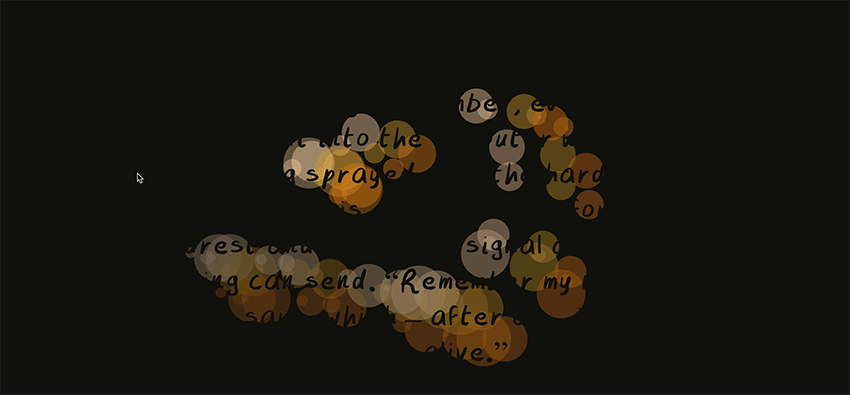
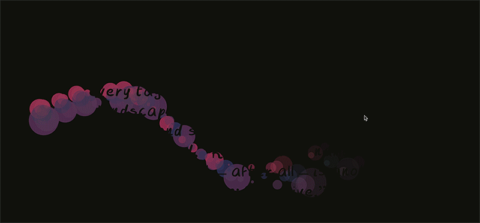

# Week #12 – It’s Showtime Baby!
This week was the big week, where all the blood, sweat, tears and ultimate confusion all came to my final design. But as an honourable mention I really wanted to show an effect I really wanted to have in my code, but I just didn’t have the right amount of time or knowledge to make it a fully functional site. I loved this effect so much but the reason it’s an honourable mention is because every time you added more fireflies on the screen, the whole thing would lag. When I say lag, I mean REALLY REALLY lag! I could go on about all the things I wanted to achieve with this project but in the end I’m still super happy with how the final project turned out. 

[Intended but Beautiful Effect WITH SOUND SOMETIMES (no idea why??)](https://astlcreations.github.io/codewords-codes-words/p5.js%20Coding%20Files/Week%20012/MainProject_FIREFLIESW12intendedeffect/)

-
-
-
-
-
-
-
-
-
-
-
-
-
-
-
-
-
-
-
-
-

✩✩✩

**AND NOW**

**DRUM ROLL PLEASE**

✩✩✩

-
-
-
-
-
-
-
-
-
-
-
-
-
-
-
-
-
-
-
-

## ✩✩✩ Wilds of the Internet ✩✩✩ ##

[Wilds of the Internet](https://astlcreations.github.io/codewords-codes-words/p5.js%20Coding%20Files/Presentation/MainProject_FIREFLIESW12Presentation/)

**Click/Drag on the Screen to Release the Fireflies**

*“Wilds of the Internet” is an interpretation of Julian Dibbell’s exploration “Viruses are Good for you” from 2005. A section diving into individual’s stories about computer viruses and their development from Dibbell’s New Media, Old Media. I was really inspired by the way he talks about such a taboo topic for most people in such a positive light. Along with the particular story of Hellraiser I wanted to show the organic growth much like literal nature that viruses take on. A life of their own that can live on forever in the big bad world. Being new to coding I wanted to take on my skills in physical creativity into the digital world, using a soft flow like a paint brush and vibrant colours, I wanted the piece to take on a life of its own. By painting the words in you actively dive past the stigma surrounding computer viruses to see that there is a beautiful life to them. I’ve loved this chance to be able to make something organic in a digital landscape, taking knowledge on drawing and painting and making it beautiful to experience, just like Dibbell wanted to show with Hellraiser, the graffiti art and virus coder.*

So overall, I’m so proud of this! When I initially finished it, I kept feeling like I could do more or have a better project but that’s definitely not how I feel now. It’s not the most technical piece in the world and that’s okay! This project is still my baby and I love it very much. 

<------------ ✩✩✩ [**Previous Week**](https://astlcreations.github.io/codewords-codes-words/SKO/Major%20Project/Week%20011/) ✩✩✩ [**Final Reflection**](https://astlcreations.github.io/codewords-codes-words/SKO/Final%20Reflection/) ✩✩✩ ------------>

