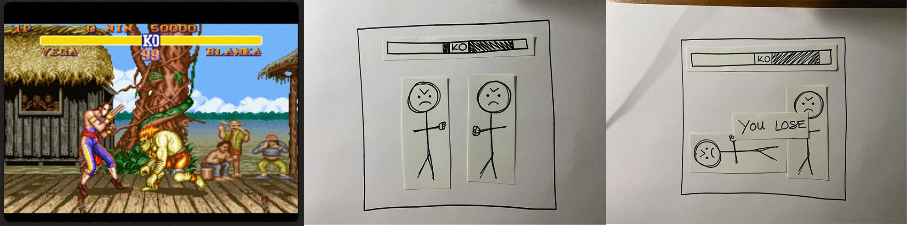

# Week #6: Paper-Prototyping and Funky Coding
This week before the lovely break, we spent the morning working on paper-prototyping and exploring what pseuto-code is. This got us to pick a popular retro 2D video game such as Pong, Tetris, Astroid Fighter, Space Invaders or Street Racer and then analyse the mechanics that need to be done in the system for the game to function. We took these mechanics and recreated them in a minimal drawn/cut paper-prototype and in almost a stop motion format showed what happened at each step. This was done in groups, so my little group analysed retro Street Fighter, an absolute favourite of mine. Though creating this prototype, it reminded me that whilst the games initially seem quite simple and straight forward, they actually require a lot of little instances and little bits of instruction for it to function. For example, in Street Fighter every time a character comes into contact (in a certain way) with the opposite character they have to lose a certain amount of health. That keeps happening until someone has to die which means the game is over. Creating this prototype was super helpful as a reminder to break it down so it’s easier to understand every functioning part. 

For fun we also combined some games and I came up with a Street Fighter and Street Racer combo where you have to make someone crash off the road while objects along the road get in the way (side note I would totally give that game a go!).

We also practiced pseudo-code by creating a small version based on an everyday activity. I decided to do one based on cuddling my cat and I have to say, I enjoyed how much this sounds like a poem. I could imagine a whole poetry book with these types of code, but it was an eye opener to see the initial pre-code way to highlight what needs to be worked into the code itself. 

*START
IF cat is in vicinity 
THEN pick cat up

*IF cat is happy
THEN stroke cat
ELSE 
IF cat is angry 
THEN put cat down immediately
ENDIF*

For the afternoon we again did some more coding but with large chunks of text instead and overall it was cool reminder of how specific you need to be with the language sometimes. For instance, I copied and pasted a poem by Rupi Kaur from the internet the program didn’t like it because it used the wrong kind of quotation marks. CRAZY ANNOYING TO WORK OUT! But it was a cool mistake to know that you need to ensure the right kind of text is used in the system or it just won’t work, lots of playing around trying to work out what the problems are. Karen also showed us how to adjust the leading based on mouseX and mouseY which was a funky bit of interaction to explore for a site.

