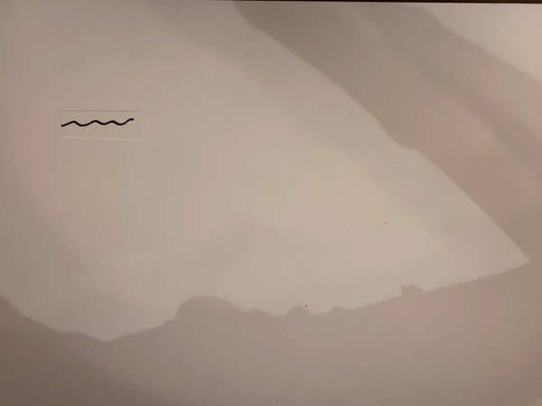
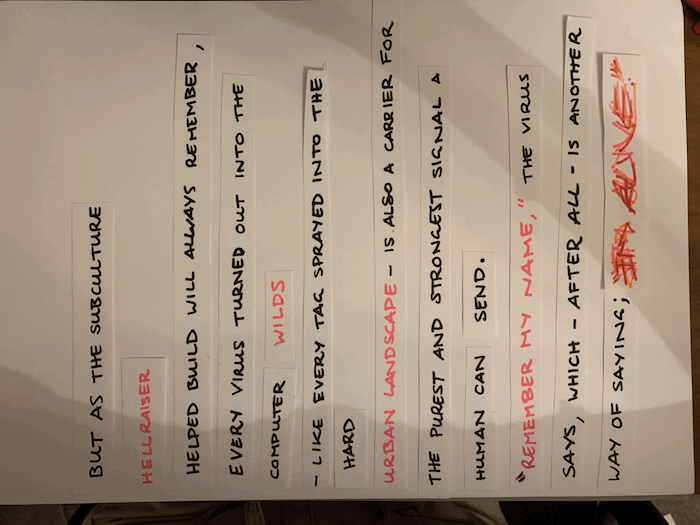

# ✩✩✩ MID SEMESTER BREAK ✩✩✩

During this break I have been focusing on making some paper-prototypes and exploring the bit of text I would like to use for my major project. Reading through the *Viruses are Good for You* text I really resonated with the first Part that focuses on a young virus writer called Hellraiser from New York. He started out as a graffiti artist by tagging the streets of New York but developed an interest in making and developing computer viruses as a way you could “get your name around the world.” In particular within this section below Dibbel talks about Hellraiser and his creations as a “computer wilds” and pairing this with Hellraiser’s graffiti background I can see a lot to work with for this. Mainly for my idea of physical/digital mediums. 

*But as the subculture Hellraiser helped build will always remember, every virus turned out into the computer wilds – like every tag sprayed onto the hard urban landscape – is also a carrier for the purest and strongest signal a human being can send. “Remember my name,” the virus says, which – after all – is another way of saying; “I’m alive."*

### (---------------------------------------------------------------) ###
  
With this section I made a few prototypes for what could work really well for this. When reading it initially I really wanted to show off the graffiti aspect of Hellraiser. This first one utilised a brick wall made from the words and then as the user interacts with their mouse it creates a spray paint effect to replace the words with “I’m alive.” Leaning into the permanence that both spray painting and viruses can provide in our modern-day world. A balance of art and technology.

### (---------------------------------------------------------------) ###

For the second prototype I focused on the spreading a virus operates under and that as a permanence. So the words are set out like an urban environment, buildings along a skyline while some of the key words in the section are overlapped and appear almost infected. When the user clicks on the words the colours of the other words begin to change colours and also become infected and changed. Following that similar concept of making yourself live forever and ever.   

I have also been working on making my GitHub all fancy and up to date, which has taken up a good chunk of this time. I’m super happy with how its looking and that I’ve actually taken the time reflect on the first half of this studio rather than leaving it all to the end. We have explored some awesome topics and I’m excited to apply these to my own major project in a cool and fancy way. 

<------------ ✩✩✩ [**Previous Week**](https://astlcreations.github.io/codewords-codes-words/SKO/Major%20Project/Week%2006/) ✩✩✩ [**Next Week**](https://astlcreations.github.io/codewords-codes-words/SKO/Major%20Project/Week%2007/) ✩✩✩ ------------>

