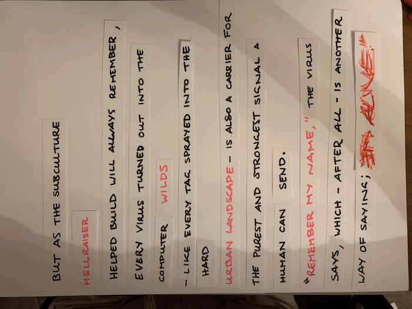

# Week #7 – Sharing Prototypes and Coding with Music

This week coming back from the break started with us sharing around our paper prototypes in little breakout groups. This was really nice to get some feedback on what I made over the break, I was still feeling a little bit stuck as to if these were really promoting the text in the right way. I really wanted to explore it in this project and after chatting about the idea with the breakout group I realised that I could push it a bit more. Mainly because I was focusing on the virus aspect of the text and forgetting about how Dibbel explores them in a positive way. So definitely for next week I would love to explore this in a deeper way to highlight the positives of why viruses are good for you.

*Last Weeks Gif for Reference*

### (---------------------------------------------------------------) ###

In the afternoon we continued with some more coding practice, with this time exploring audio and how it can affect the shapes/other elements of the project. This was definitely confusing at first but super interesting to learn about as it inspired me for another idea regarding my major project (but ill share that next week!). After class I played with the code Karen made with us and turned it into my own little creation. I found an audio file of church bells I recorded when I was on a trip in England years ago, so the project was inspired by the loudness of those bells. I also played with shapes too but I’m super happy with how it turned out and I can wait to use some audio of my own in my final project.   

[Can You Hear the Bells?](https://astlcreations.github.io/codewords-codes-words/p5.js%20Coding%20Files/Week%207/soundDraft2/)

<------------ :star: [**Previous Week**](https://astlcreations.github.io/codewords-codes-words/SKO/Major%20Project/Week%2007.5%20-%20Mid%20Sem%20Break/) :star: [**Next Week**](https://astlcreations.github.io/codewords-codes-words/SKO/Major%20Project/Week%2008/) :star: ------------>

