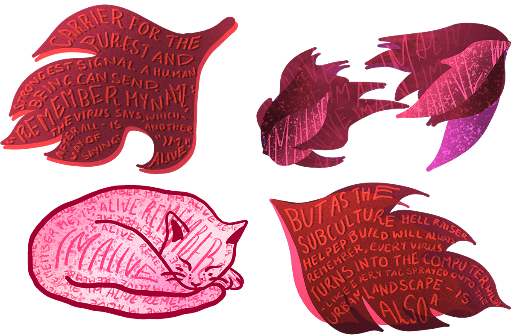
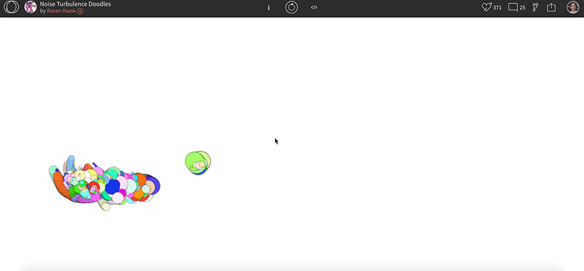

# Week #9 – Oh Goodness I’m Getting Lost
Over the week I began to work on some illustrations/wording for the gif idea (which you can see from last week!). I started working on this because I was feeling really REALLY lost about what I could do with the coding based on my skills. Plus, with my idea of blending the digital with physical materials, this felt like a cool step to blend the two. However, getting feedback on this progress, it seemed to be going a little bit too illustration based rather than type based. The biggest point being, I needed some inspiration from other coders of what I could do myself. So even though I won’t be using these for my final project, I would love to create this in my own time because I just love these illustrations! 

Taking a step back from them, I found a really cool design from a Raven Kwok which inspired another way of adding that illustration without taking away from the typography (shown in the gif below!). I love how organic the “brush” is and would definitely reference the wild part that Dibbell talks about within the text. It seems achievable enough to create in my own way and since the code is done in java script, I am going to have to teach myself how to translate it to p5.js instead!

## [~ Check it out Here ~](https://www.openprocessing.org/sketch/143842)

