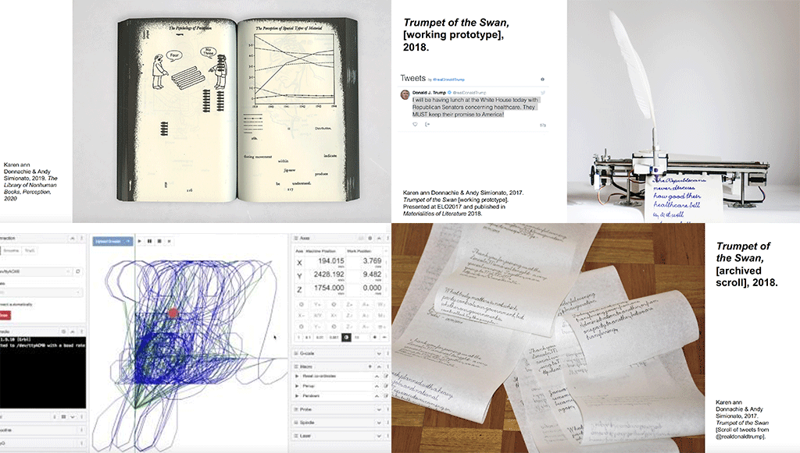

# Week 1: Introduction into the Craziness (At least in my Eyes)

So today was the first day into the lovely studio that is “Codewords = Codes + Words”!! We started with a lovely introduction into what we would be doing throughout the semester and also some of the cool projects we would be working on. Karen and Andy also showed us a few of their own projects that they have created using code. “Trumpet of the Swan” was a computer that hand scripted Donald Trump tweets every time he tweeted which was such a cool mix of traditional recording methods mixed with the modern-day social media method. 

We went exploring around Melbourne in COVID-19 style, through a Minecraft world of the Melbourne CBD. I haven’t played Minecraft in forever so it was awesome to get back into and explore some ideas that could be awesome for the Re-Readings project. But as we were doing this we were chatting about Hyper textuality and how other designers/artists have used it such as other video games to recreate literature or media. In particular using Call of Duty to recreate a scene from F.R.I.E.N.D.S., which was so interesting to talk about in our ever-increasing digital world. 

Then it was for the very daunting part, LEARNING HOW TO CODE. It’s something I have wanted to learn for ages to incorporate into my design projects. I was very nervous and excited because it was actually some dedicated time for me to practice my skills. Karen took us through some basics with a program called processing which uses a language called “p5.js”. We were focusing on basic shapes, colours commands and just generally learning the language so we could create our initials with the program. I loved doing this because I realised it’s not as scary as I imagined and there are so many cool possibilities for me to discover!

