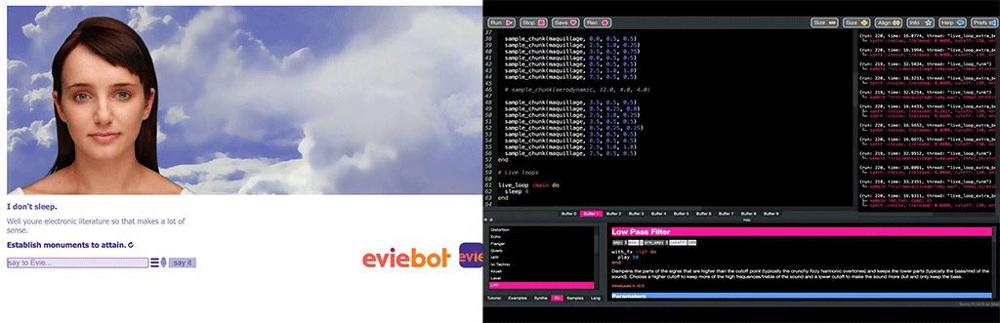
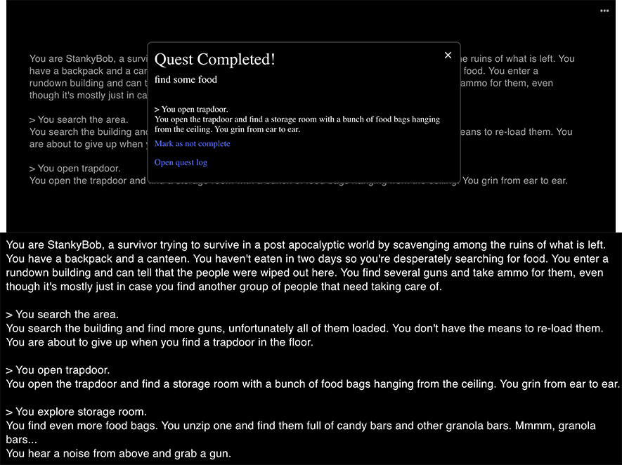
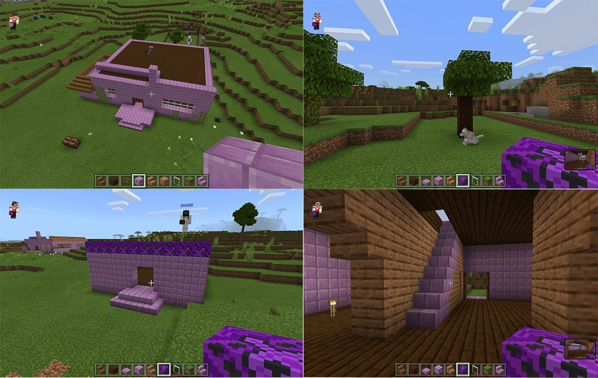

# Week 3: Electronic Literature, Stankybob & Playing in Minecraft

This morning we explored the wonderful world that is electronic literature! This is basically like regular literature but within a digital space such as games, websites and many more. One of the cool things that I learnt from this morning is how much variety there is when it comes to what electronic literature is. I didn’t even realise that some of the video games I know and love actually counted towards this category of literature. In particular one called EvieBot, which a chatbot that responds to you only using things that other people have typed into the program. I love this program and I’ve seen it used by many Youtubers which creates a hilarious video of a random conversation. 

[Evie Bot](https://www.eviebot.com/en/)

[Daft Punk Live Coding](https://www.youtube.com/watch?v=cydH_JAgSfg&feature=emb_logo&ab_channel=mxs)

### (---------------------------------------------------------------) ###

We also played with a generative text program/game called *AI Dungeon*, which creates a story for you that develops as you play along with it. In class we had a hilarious strange time playing with a horror story that ended up with people killing God (hilarious and extra crazy!). Unfortunately, I forgot to record it but I did go back and create my own apocalypse story with my character StankyBob (we don’t talk about why he’s stanky) where I ended up being a total badass. It reminded me of a video game that follows this form of storytelling called Buried which is also a horror text game that changes based on the choices you pick. I love this idea though and I would be keen to explore that for my own final FINAL project. 

## [~ You Can Play It Right Here ~](https://play.aidungeon.io/main/landing)
OR
[Check out the Chronicles of Stanky Bob](https://astlcreations.github.io/codewords-codes-words/SKO/Re-Readings%20&%20Coding/Week%2003/Chronicles%20of%20StankyBob/)

It reminded me of a video game that follows this form of storytelling called Buried which is also a horror text game that changes based on the choices you pick. I love this idea though and I would be keen to explore that for my own final FINAL project. 

## [~ Here Is His Video ~](https://www.youtube.com/watch?v=JZYwn4noWho&ab_channel=Markiplier)

### (---------------------------------------------------------------) ###

For the rest of the day we were working in our groups for the Re-Readings project. We ended up playing around with the house idea in Minecraft and building a traditional historic looking house. Mainly focusing on the idea of the house being bigger on the inside than it is on the outside, but also how we were going to represent the final bit in the section where the dog has chased a cat up a tree. It was fun to explore how we are going to make this, but I think I would love to explore the biomes of the game to fully take advantage of what it has to offer. 

