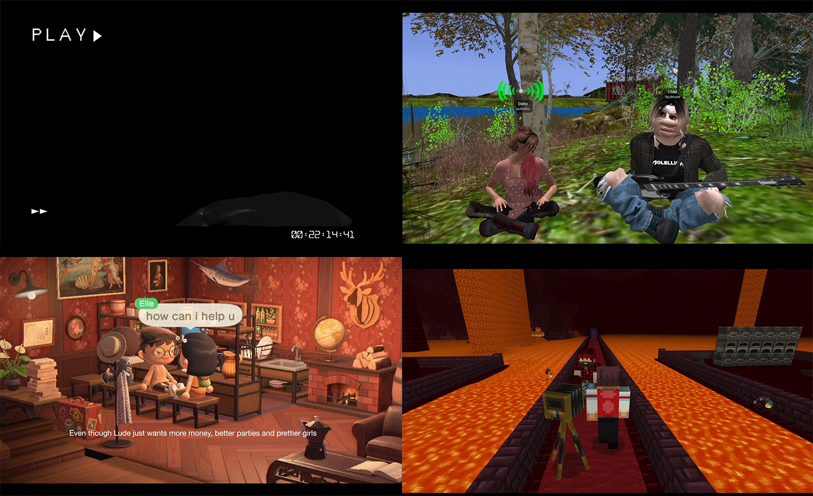
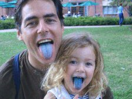

# Week #5: Video Premier/Screening and Final FINAL Project

Today was the day where we watched everyone’s video creations for the Re-Readings Project! It was nerve wracking to show our groups video but seeing all the cool interpretations that everyone came up with in their game’s universe was super inspiring (felt a bit like a proud mum watching them all!). People used games such as The Sims, Animal Crossing, Club Penguin and Second Life which honestly just made me want to play more video games when class finished for the day. So overall, I loved working on this project!

For the second half we began exploring all the different texts that we could work with to create a website for our final FINAL project. I particularly took an interest in a text called “Viruses are Good for You”. Written by Julian Dibbel in 2006, the text is a section within the book “New Media, Old Media” that dives into the topic of computer viruses. He explores this through personal stories of computer virus writers to highlight that initial reactions to viruses within a digital space should be reconsidered. Allowing readers to see the creative possibilities of a permanent digital existence long after we go. In particular when interviewing a virus creator called Hellraiser, a quote that stood out to me was “Viruses are like the electronic form of graffiti”. In my eyes wanting to find a cool combination between a physical medium and the digital space of coding I can see a lot of possibilities for both of these to pair well with this text. Plus, the way Dibbel writes is more casual with his analysis so it will be fun to play with his words and wording. 

